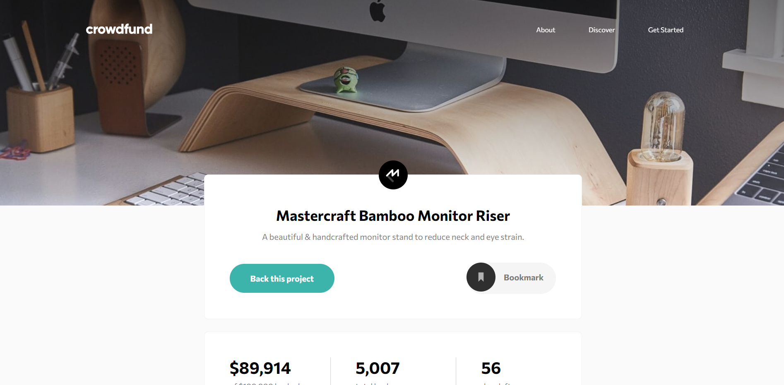

# Frontend Mentor - Crowdfunding product page solution

This is a solution to the [Crowdfunding product page challenge on Frontend Mentor](https://www.frontendmentor.io/challenges/crowdfunding-product-page-7uvcZe7ZR). Frontend Mentor challenges help you improve your coding skills by building realistic projects. 

## Table of contents

- [Overview](#overview)
  - [The challenge](#the-challenge)
  - [Screenshot](#screenshot)
  - [Links](#links)
- [My process](#my-process)
  - [Built with](#built-with)
  - [What I learned](#what-i-learned)
  - [Continued development](#continued-development)
  - [Useful resources](#useful-resources)
- [Author](#author)
- [Acknowledgments](#acknowledgments)

## Overview

### The challenge

Users should be able to:

- View the optimal layout depending on their device's screen size
- See hover states for interactive elements
- Make a selection of which pledge to make
- See an updated progress bar and total money raised based on their pledge total after confirming a pledge
- See the number of total backers increment by one after confirming a pledge
- Toggle whether or not the product is bookmarked

### Screenshot



### Links

- Solution URL: [Add solution URL here](https://www.frontendmentor.io/solutions/vanilla-js-and-sass-W_mkkqD4J)
- Live Site URL: [Add live site URL here](https://crowdfunding-product-page-tau-plum.vercel.app/)

## My process

### Built with

- Semantic HTML5 markup
- CSS custom properties
- Flexbox
- CSS Grid
- Mobile-first workflow
- SASS

### What I learned

I made a custom radio button and used the <label> tag to make the click area bigger. Anything that I put in a label tag will be connected with the input tag.

```html
<input class='radio-input' type="radio" name="selection" value="noReward" id="noReward">
        <label for='noReward' class="selection__label flex flex-ai-c">
          <div class="radioCircle"></div>
          <div class='selection__header'>
            <h3>Black Edition Stand</h3>
            <span class='pledge-label'>Pledge $75 or more</span>
          </div>
```
I learned that adding some blank javascript to an anchor tag was better than adding #. When I add #, the anchor tag scrolls to the top of the page and creates an empty entry in the browser history. This makes it more difficult more the user to use the back button and the scrolling was disorienting. Adding the blank javascript in this way also retains keyboard and hover functionality which is useful for accessibility. 

```html
<a href="javascript:void(0);" class="product__bookmark flex">
```
I found myself writing font-size and line-height on most elements. These mixins helped me to quickly convert pixels to rem units without having to calculate them all myself.

```css
@mixin font-size($sizeValue) {
  font-size: $sizeValue / 16 + rem;
}

@mixin line-height($sizeValue) {
  line-height: $sizeValue / 16 + rem;
}
```
```js
const proudOfThisFunc = () => {
  console.log('🎉')
}
```

### Continued development

In the future I want to add Stripe payment functionality, the ability to change to different crowdfunding campaigns, and login features. The scope of this project was mainly to practice styling elements. 

### Useful resources

- [Create a neon button with a reflection using CSS](https://www.youtube.com/watch?v=6xNcXwC6ikQ&t=788s) - This was visually stunning and was fun to add to my placeholder pages. Click on any of my navigation links to see this cool CSS only neon effect in action.

## Author

- Github - [Add your name here](https://github.com/seanred360)
- Frontend Mentor - [@yourusername](https://www.frontendmentor.io/profile/seanred360)

## Acknowledgments

Thanks to [Daniel](https://www.frontendmentor.io/profile/daniel-g-p)